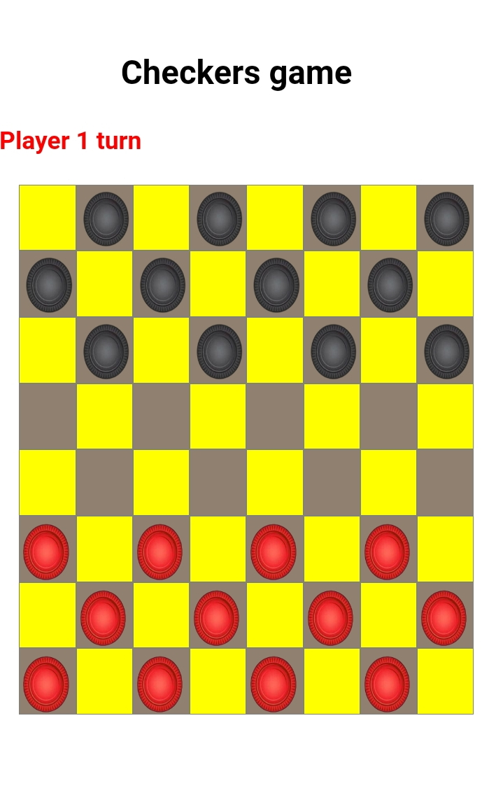
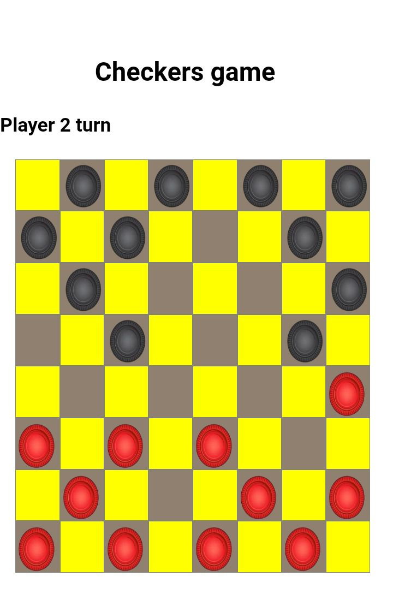
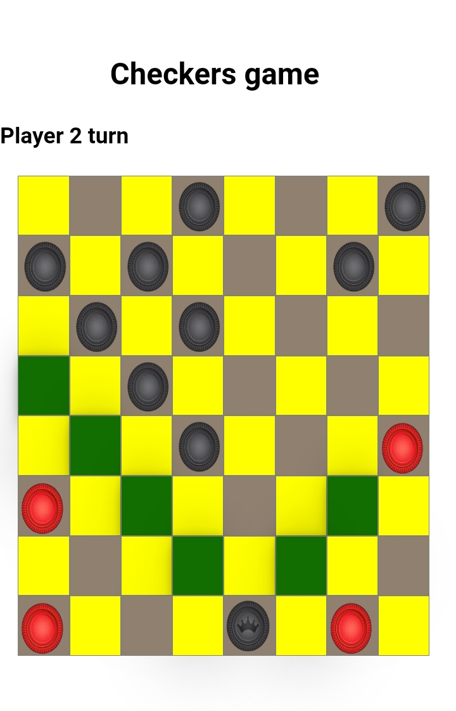
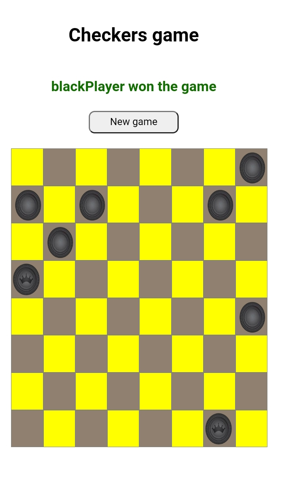

# Checkers Web App

This is a implementation of a two player checkers game using react. You can see check the live demo [here](https://checkers-web-app.vercel.app/)

## Game rule implemented

The rules of this checkers implementation are the brasilian checkers:

-   Normal Pieces can capture backwards
-   Captures are mandatory
-   Queen can move more than a square
-   8x8 grid

## TODO

-   Add a online multiplayer implementation

## ScreenShots

